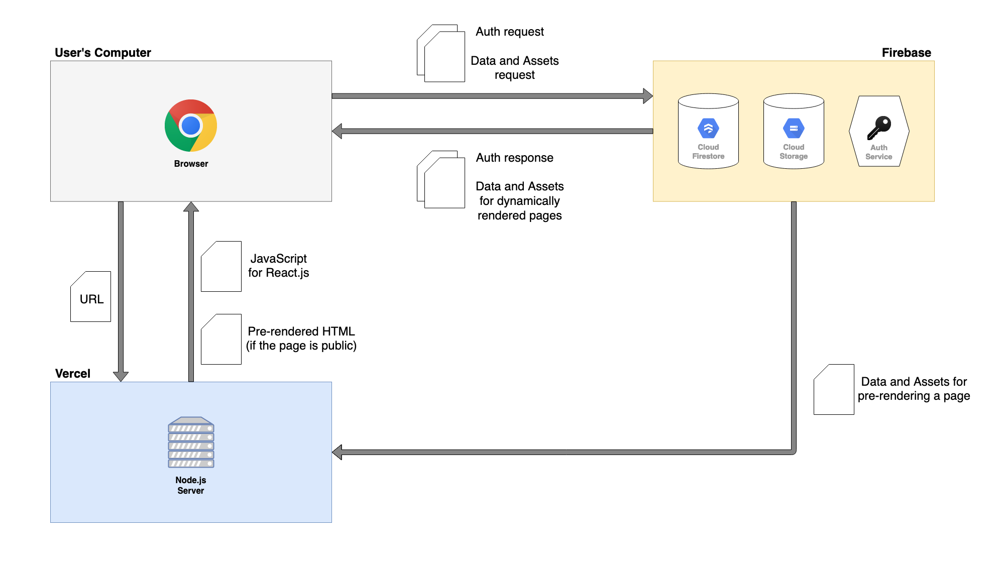

# Nextfire Blog

A demo blog app inspired by Dev.to and Medium blogging websites

Built with [React](https://reactjs.org/) + [Next.js](https://nextjs.org/) + [Firebase](https://firebase.google.com/), 
styled with [Tailwind CSS](https://tailwindcss.com/) and deployed to [Vercel](https://vercel.com) \
Check it live at [demo1.popovs.dev](https://demo1.popovs.dev)

## Features

The purpose of this app is to demonstrate the capability to implement a certain **feature set**, \
Which includes, but is not limited to:
* Blogging website implemented as a Single Page Application
* Server-side rendering of publicly accessible pages (for better SEO)
* Likes/hearts/upvotes functionality in realtime
* Lazy loading of posts
* Basic CMS with full set of CRUD operations
* Responsive design
* Dynamic switching between Light and Dark themes

## Architecture

This app uses Firebase as its headless backend, thus it consists of 2 parts:
1. User-facing app (deployed on and fetched from Vercel)
2. Firebase services (hosted by Google)

Here's a diagram of how it works!

## Credits

Up until the [First Pull Request](https://github.com/ilyapopovs/nextfire-blog/pull/1) the app had been developed by 
going through Jeff Delaney's [Next.js Firebase Course](https://fireship.io/courses/react-next-firebase/). \
Thereafter, I continued independently improving the app and adding new features as I saw fit. The list of those 
features can be seen in the [commit history](https://github.com/ilyapopovs/nextfire-blog/commits/main).
